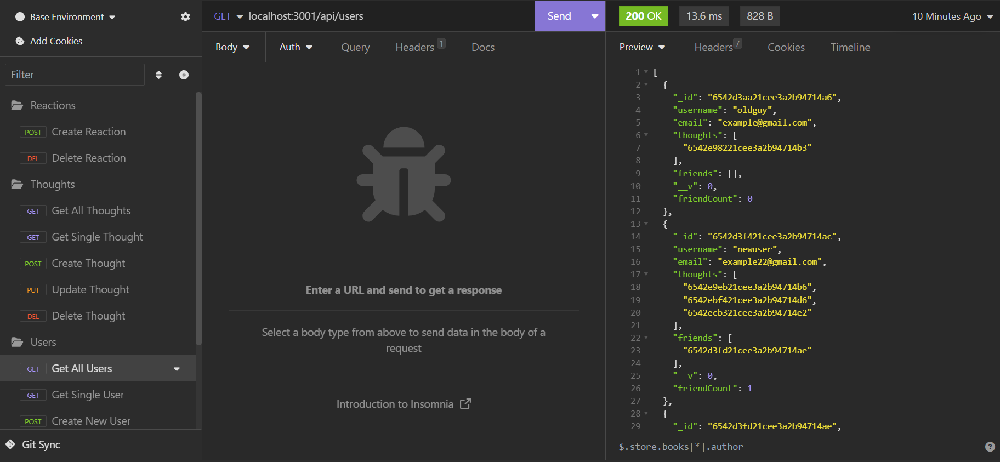

# Social Media API
## Description
This is an example API for a social network where users can add other users as friends, share thoughts and in turn react to others thoughts, powered by Express.js and MongoDB.
An example of a getAll query:

An example of creating a thought:

## Table of Contents

- [Description](#description)
- [Installation](#installation)
- [Usage](#usage)
- [Questions](#questions)
## Installation
Clone the github repo, this is only a back-end API.

## Usage
As this is only an API, users wanting to test routes can use an application such as Insomnia or Postman to mimic a client-side action such as creating an account or sharing thoughts. Or build the front-end yourself and test your ability to connect a webpage and make API requests and use the returned data.
## Questions
For any questions you can reach out to me at:

My Email: [ziad.t.alfadl@gmail.com](mailto:ziad.t.alfadl@gmail.com)

My GitHub: [https://github.com/Z-Alfadl](https://github.com/Z-Alfadl)
